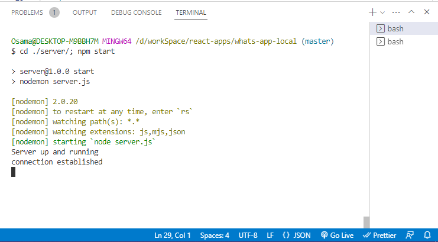
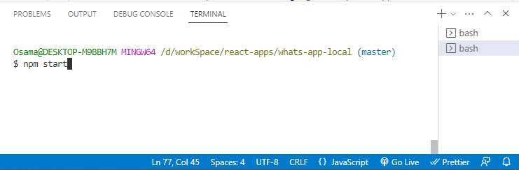
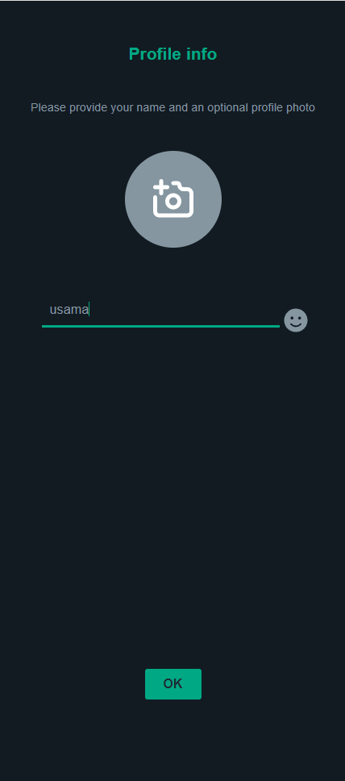
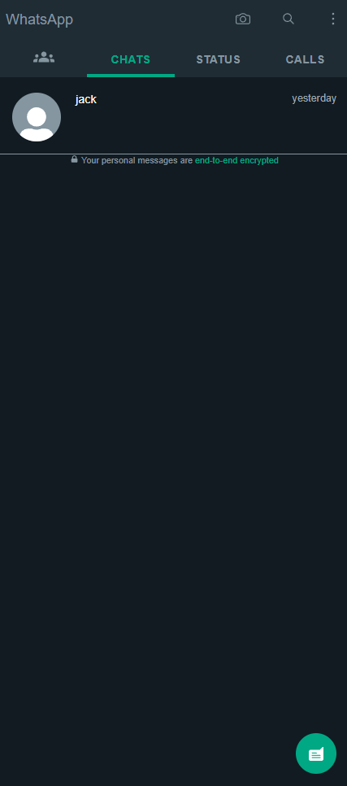
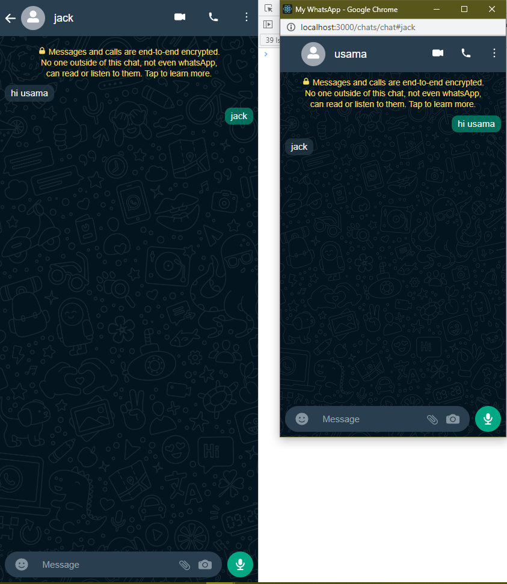

# Whats-app-local-chat

# How it works

First you have to run the server

Then run the client on a different terminal

Enter your name

Here you see your contacts

You can add contacts to chat with

To start a chat click on the contact

